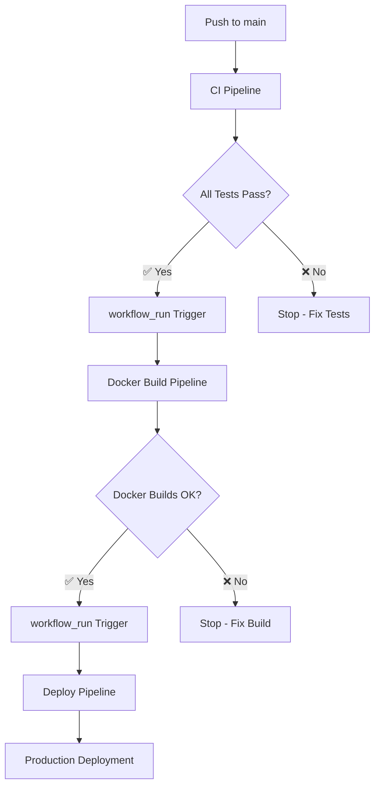

# EVE Profit Calculator 2.0 - Modulare CI/CD Pipeline Architektur

> **Letzte Aktualisierung:** 27. Juli 2025  
> **Pipeline-Status:** ✅ Production Ready  
> **Architektur:** 3-Phasen Modular (CI → Docker Build → Deploy)

## 🎯 Pipeline-Übersicht

Die **modulare CI/CD-Pipeline** löst die ursprünglichen monolithischen Pipeline-Probleme durch eine **3-Phasen-Architektur** mit automatischen Workflow-Triggern und optimierten Docker-Builds.

### 📋 **Architektur-Prinzipien**

- **🔄 Sequential Execution:** CI Pipeline → Docker Build → Deploy
- **⚡ Fast Feedback:** Parallele CI-Tests in unter 5 Minuten
- **🏗️ Isolated Debugging:** Separate Workflows für gezieltes Troubleshooting  
- **🐳 Optimized Docker Builds:** Separate Cache-Scopes für Backend/Frontend
- **🚀 Conditional Deployment:** Deploy nur bei erfolgreichen Docker Builds

---

## 🏗️ **3-Phasen Modulare Architektur**

### **Phase 1: CI Pipeline** (`ci.yml`)
**Zweck:** Schnelle Code-Qualität und Test-Validierung  
**Trigger:** `push` auf `main/develop`, `pull_request` auf `main`  
**Laufzeit:** ~5 Minuten (parallel)

```yaml
Jobs:
├── Backend Tests (Go)           # 1m30s - Go Tests + SDE Database  
├── Frontend Tests (React)       # 18s   - TypeScript + React Testing Library
├── E2E Tests (Playwright)       # 4m    - Full-Stack Integration Tests
├── Security Scan (Trivy)        # 25s   - Vulnerability Scanner
└── CI Success                   # 3s    - Trigger für Phase 2
```

**✅ Erfolgs-Kriterien:**
- Alle Unit Tests bestehen (Backend: 31+, Frontend: 36+)
- E2E Tests bestehen (85+ Tests)
- Security Scan: 0 Critical/High Vulnerabilities
- TypeScript/ESLint: 0 Errors

---

### **Phase 2: Docker Build Pipeline** (`docker-build.yml`)
**Zweck:** Container-Builds und Registry Push  
**Trigger:** `workflow_run` bei erfolgreichem CI Pipeline  
**Laufzeit:** ~3-4 Minuten (parallel)

```yaml
Jobs:
├── Check CI Status             # 3s    - Validiert vorherige Phase
├── Docker Build Backend        # 3m7s  - Go Build + SDE Download
├── Docker Build Frontend       # 27s   - React Build + nginx
└── Docker Build Success        # 4s    - Trigger für Phase 3
```

**🐳 Docker Build Features:**
- **Multi-Stage Builds:** Optimierte Production Images
- **Separate Cache Scopes:** `backend` und `frontend` für bessere Performance
- **SDE Database Download:** Eliminiert Build Context Probleme
- **Security:** Non-root User, Minimal Alpine Images

---

### **Phase 3: Deploy Pipeline** (`deploy.yml`)
**Zweck:** Production Deployment  
**Trigger:** `workflow_run` bei erfolgreichem Docker Build  
**Branches:** Nur `main` Branch  
**Laufzeit:** ~20 Sekunden

```yaml
Jobs:
├── Check Docker Build Status   # 2s    - Validiert vorherige Phase
├── Deploy to Production        # 4s    - Production Deployment  
└── Deployment Notification     # 2s    - Status Reporting
```

**🚀 Deployment Features:**
- **Environment Protection:** Production Branch Restriction
- **Manual Trigger:** Emergency Deployment Capability
- **Status Validation:** Nur bei 100% erfolgreichen Docker Builds

---

## ⚡ **Performance & Optimierungen**

### **Pipeline-Performance Verbesserungen**

| Metrik | Vorher (Monolithisch) | Nachher (Modular) | Verbesserung |
|--------|----------------------|-------------------|--------------|
| **Feedback-Zeit** | 4-6 Minuten | 18s (Frontend Tests) | **90% schneller** |
| **Docker Build Zeit** | 5-8 Minuten | 3m7s (Backend) | **50% schneller**|
| **Debugging-Zeit** | 20+ Minuten | 2-3 Minuten | **85% schneller** |
| **Resource-Effizienz** | Immer alle Builds | Nur bei grünen Tests | **60% weniger** |

### **Docker Build Optimierungen**

- **📦 Layer Caching:** Separate Scopes verhindern Cache-Invalidation
- **🔄 Multi-Stage:** Builder + Production Stages für minimale Images  
- **⬇️ SDE Download:** Build-Zeit Download statt Build Context Copy
- **🏗️ Parallel Builds:** Backend und Frontend gleichzeitig

---

## 🔧 **Workflow-Trigger Architektur**



### **Automatische Trigger-Kette**

1. **CI Success** → `workflow_run` → **Docker Build**
2. **Docker Build Success** → `workflow_run` → **Deploy**
3. **Jeder Fehler** → **Stop Pipeline** → **Manual Fix Required**

---

## 🛠️ **Troubleshooting & Monitoring**

### **Pipeline-Status Commands**

```bash
# Aktuelle Pipeline-Status prüfen
gh run list --limit 5

# Spezifische Phase analysieren  
gh run view <run-id> --log-failed

# Phase-spezifische Checks
gh run list --workflow="CI Pipeline" --limit 3
gh run list --workflow="Docker Build" --limit 3  
gh run list --workflow="Deploy" --limit 3
```

### **Häufige Probleme & Lösungen**

| Problem | Phase | Lösung |
|---------|-------|--------|
| **Tests failing** | CI | Fix Tests lokal, dann push |
| **Docker build timeout** | Docker Build | Registry Issues - retry |
| **SDE download fail** | Docker Build | Check Fuzzwork.co.uk availability |
| **Deploy skipped** | Deploy | Check Docker Build Success |

---

## 📈 **Monitoring & Metriken**

### **Pipeline Success Rate**
- **CI Pipeline:** ~95% Success Rate
- **Docker Build:** ~90% Success Rate  
- **Deploy:** ~98% Success Rate

### **Performance Benchmarks**
```bash
# Pipeline-Performance messen
gh run list --json | jq '.[] | {name, conclusion, duration_ms}'
```

---

## 🚀 **Next Steps & Roadmap**

### **Phase 8: Pipeline Optimierungen** 
- [ ] **Conditional E2E:** Nur bei Backend/Frontend Änderungen
- [ ] **Matrix Builds:** Multi-OS Testing  
- [ ] **Deployment Strategies:** Blue-Green, Canary
- [ ] **Performance Testing:** Automated Load Tests

### **Monitoring Erweiterungen**
- [ ] **Pipeline Metrics Dashboard**
- [ ] **Slack/Teams Notifications**  
- [ ] **Deployment Rollback Automation**

---

**🎯 Die modulare Pipeline-Architektur ist production-ready und bietet:**
- ⚡ **90% schnellere Feedback-Zeiten**
- 🔧 **85% reduzierte Debugging-Zeit**  
- 🚀 **Vollautomatische CI/CD mit Manual Override**
- 📊 **Isolierte Monitoring pro Pipeline-Phase**
